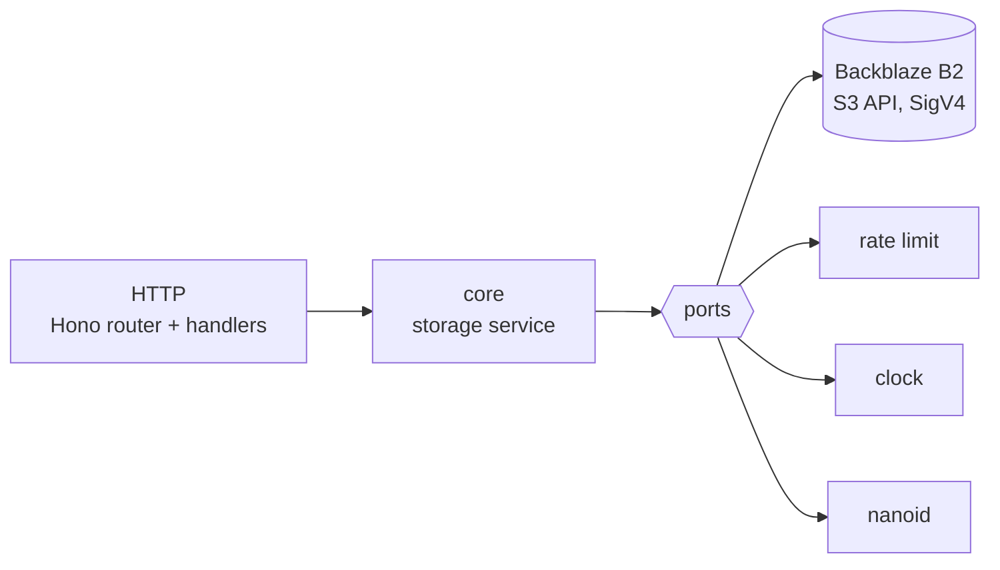

# egarots

**API-only object storage on Cloudflare Workers.** `POST` bytes, get a short id back.
`GET` that id, get the bytes back with the content type you sent. That is the whole
product.

The name is `storage` backwards. Like its sibling [nikednep](https://github.com/davidasync/nikednep)
— `pendekin` reversed — it is a short, opaque, reversible encoding of something
meaningful, which is exactly what the id it hands you is.


|  |  |
| --- | --- |
| **Runtime** | Cloudflare Workers — TypeScript + Hono |
| **Storage** | Backblaze B2 over its S3-compatible API — no database, no schema, no migrations |
| **Cost** | Free at this scale, and **capped** — B2 supports a real daily spend limit. See [Free tier](#free-tier) |
| **Surface** | No UI, no login — the four endpoints below are all of it |

> [!NOTE]
> **Why B2 and not Cloudflare R2**, when everything else here is Cloudflare? R2 has no
> hard spend cap — only alerts — so an anonymous public upload endpoint on it has an
> unbounded worst case. B2 has account-level daily caps that actually stop the service,
> cheaper storage, and free uploads. The cost is that B2 is not a binding: every request
> is an outbound HTTP call that this Worker signs itself. That trade is the single
> biggest design decision in the project.

## Quick start

```bash
make install
make config      # copies wrangler.toml.example -> wrangler.toml

# No B2 account needed to start: this runs a local stand-in that verifies the
# request signatures exactly as B2 would, then points the Worker at it.
make fake-b2     # in one shell, listens on :9000
make dev-fake    # in another,  http://localhost:8082
```

To run against the real thing instead, put your key in `.dev.vars` (copy
`.dev.vars.example`), leave `B2_ENDPOINT` commented out, and use `make dev`.

```bash
printf 'hello from egarots' | curl -s -X POST \
  'http://localhost:8082/api/objects?ttl=3600&filename=hello.txt' \
  -H 'content-type: text/plain; charset=utf-8' --data-binary @-

curl -s http://localhost:8082/<id>
```

There is no migration step and no schema.

> [!NOTE]
> The stand-in recomputes the AWS SigV4 signature from the incoming request and answers
> `403` on a mismatch, so it exercises the signer rather than trusting it. `make test-sigv4`
> additionally checks the signer against the published AWS test vector. What it cannot
> reproduce is the **lifecycle rule**, which is an account-side setting — the storage
> backstop in [Expiry](#expiry) is untested until you deploy.

## API

| Method | Path | Purpose |
| --- | --- | --- |
| `POST` | `/api/objects` | store bytes — `201` with the id |
| `GET` | `/:id` | the bytes back |
| `HEAD` | `/:id` | metadata only, no body, no egress |
| `GET` | `/health` | liveness check — `200` `{ "ok": true }` |

Rate limit: **20 writes per IP per minute**, via Cloudflare's rate limiting binding.

### Store an object

The body *is* the object, so metadata rides on headers and query parameters rather than
in a JSON envelope.

```http
POST /api/objects?ttl=604800&filename=notes.txt
Content-Type: text/plain; charset=utf-8
Content-Length: 12

hello world
```

```http
201 Created
Location: /V1StGXR8Z5jd

{
  "id": "V1StGXR8Z5jd",
  "url": "https://egarots.example.workers.dev/V1StGXR8Z5jd",
  "size": 12,
  "contentType": "text/plain; charset=utf-8",
  "filename": "notes.txt",
  "createdAt": "2026-09-20T09:00:00.000Z",
  "expireAt": "2026-09-27T09:00:00.000Z"
}
```

| Input | Where | Required | Rules |
| --- | --- | --- | --- |
| body | request body | yes | 1 – **1,048,576** bytes (1 MiB) |
| `Content-Length` | header | **yes** | integer, at most the cap. Absent → `411` |
| `Content-Type` | header | no | any valid media type, at most 255 characters. Absent → `application/octet-stream` |
| `ttl` | query | no | integer seconds, 1 – **604800** (7 days). Default 604800 |
| `filename` | query | no | at most 255 printable characters. Any path is reduced to its basename |

> [!NOTE]
> `Location` is set because RFC 9110 says a `201` should carry it, but the id is in the
> **body** — `Location` is not readable cross-origin unless explicitly exposed, and relying
> on it is what made the dpaste client this replaces scrape two places and hope.

### Why `Content-Length` is mandatory

The size cap has to bite *before* the body is buffered, or the isolate has already spent
the memory that the cap exists to protect. That header is the only pre-body signal, so a
request that cannot be sized is refused with `411` rather than read hopefully.

In practice nothing real breaks: `fetch()` with a `Blob`, `ArrayBuffer` or string body
always sets it, and so does `curl --data-binary @file`. Chunked streaming uploads do not,
and are not supported.

A declared length is a claim, not a fact, so the real byte count is checked again after
buffering. Both checks are load-bearing.

### Fetch an object

`GET /:id` returns the stored bytes. The response carries:

| Header | Value |
| --- | --- |
| `Content-Type` | as stored, unless it is a type a browser would execute — see [Serving untrusted bytes](#serving-untrusted-bytes) |
| `Content-Disposition` | `attachment` by default |
| `Cache-Control` | `public, max-age=<min(remaining TTL, 3600)>, immutable` |
| `ETag` | the stored object's etag, for free browser revalidation |
| `X-Expires-At` | ISO 8601 |
| `X-Content-Type-Options` | `nosniff` |
| `Content-Security-Policy` | `default-src 'none'; sandbox` |
| `Cross-Origin-Resource-Policy` | `cross-origin` |
| `Referrer-Policy` | `no-referrer` |

`?disposition=inline` asks for inline rendering. It is a *preference*: it is honoured only
for `text/plain`, `application/json`, `text/csv` and PNG/JPEG/GIF/WebP, and silently
overruled back to `attachment` for everything else.

`Range` requests are deliberately not supported and `Accept-Ranges` is not advertised.
There is nothing to seek within a megabyte, and seekable responses are exactly what makes
a host attractive for serving media, which this is not.

### Browser callers

CORS headers are sent for an allowlist of origins, set as the `ALLOWED_ORIGINS` var in
`wrangler.toml`, a comma-separated list. Unset allows no browser origin at all.

> [!IMPORTANT]
> This is where egarots differs from nikednep. There, only `/api/*` needed CORS, because
> `GET /:code` is a `302` the browser *navigates* to. Here the read path is a cross-origin
> `fetch()` whose body must be readable, so **CORS covers reads too** — and is registered
> on `/*` so that error responses carry it as well. A `429` without CORS headers reaches
> the browser as an opaque network failure, exactly when the client most needs to tell
> "rate limited" from "offline".

An upload carries an arbitrary `Content-Type`, which is never a CORS-safelisted value, so
`POST` always preflights and costs **two** Worker requests. `Access-Control-Max-Age` is a
day, which amortises that to one preflight per browser per day. A plain `fetch(url)` read
does not preflight — send no custom headers on reads and it stays one request.

### Errors

Every error responds with `{ "error": "<message>" }`.

| Status | When |
| --- | --- |
| `400` | empty body, or `ttl` / `content-type` / `filename` failed validation |
| `403` | no `cf-connecting-ip`, so the write cannot be attributed to anyone |
| `404` | no object for that id — never created, expired, or not even an id shape |
| `411` | no `Content-Length` header |
| `413` | larger than 1 MiB, by declared length or by actual bytes |
| `429` | over the rate limit |
| `500` | unhandled — logged, never detailed to the client |
| `503` | the store refused the write, or no id could be allocated |

> [!NOTE]
> There is no `410 Gone`. An expired object, an id that never existed and a malformed id
> are all `404` with the same body. A distinct status would confirm that an id was once
> real, and with no auth and no listing the id is the only thing protecting the bytes.

## Architecture



```text
src/
  index.ts                  Worker entry
  container.ts              composition root — the only place ports meet adapters
  core/storage/             entity, errors, ports, service
  adapter/
    b2/repository.ts        the byte bag
    b2/sigv4.ts             request signing, because B2 is not a binding
    ratelimit/              binding, with an in-memory fallback
    clock/ nanoid/          the boring two
  app/http/                 router, handler, dto — and the Env interface
```

The store is four methods: `head`, `get`, `put`, `deleteExpired`.

> [!IMPORTANT]
> **The dependency rule:** `src/core` must not import `src/adapter`, `src/app`, Hono, or
> any Cloudflare binding type. `make deps-check` enforces it, which matters here because
> there are no tests and no linter to notice otherwise.

## Expiry

nikednep could hand this whole problem to KV, which expires keys itself. **B2 has no
per-object TTL**, so it takes three mechanisms.

1. `expiresAt` is written into the object's custom metadata.
2. Every read compares it to now and `404`s past it, without transferring the body.
3. A bucket lifecycle rule hides everything **8 days** after upload and deletes it the
   day after, whatever happened above.

A read past expiry also fires a delete on the way out, registered with `waitUntil` so it
survives the response — a floating promise would simply be cancelled, which is exactly
how this was wrong the first time. It is still best effort, and a B2 delete is a free
Class A transaction, so it costs nothing. It reclaims space sooner; it guarantees
nothing.

The upside over KV: there is no 60-second floor. `ttl=1` really is gone in a second, and
expiry is exact on read rather than whenever the store gets round to it.

> [!WARNING]
> **The lifecycle rule is not optional.** Lazy deletion only ever runs for objects somebody
> reads again, which is the minority. Without the rule, everything else is stored — and
> billed — forever, and nothing in the code can detect it. `make tf-apply` creates it
> alongside the bucket; if you made the bucket by hand, set it under
> *Bucket Settings → Lifecycle Settings* in the B2 console.

> [!WARNING]
> An object stops being *served* the instant `expiresAt` passes, but the bytes are not
> gone. The lifecycle rule acts at **day** granularity, counted from upload and applied
> asynchronously. "The API 404s it" is not the same as "it is erased".

`MAX_TTL_SECONDS` is capped at 7 days to match the rule, and `terraform/variables.tf`
refuses an `expire_days` below 8 so the two cannot drift apart. Raising the TTL alone
would be a bug: a caller could ask for `ttl=60` and still occupy a month of billable
storage. Longer TTLs want a TTL class encoded in the key prefix and one lifecycle rule
per prefix, so storage cost tracks the promise.

## Consistency

Backblaze B2 is strongly consistent: a `PUT` that has returned is immediately readable,
and a delete is immediately gone. So nikednep's whole consistency section — the
60-second negative cache, "a new link may 404 briefly" — does not apply here and is not
repeated.

What B2 does **not** offer is a conditional write. There is no if-none-match on `PUT`,
so there is no atomic create-if-absent and no way to detect that a generated id was
already taken; a collision would silently overwrite.

> [!IMPORTANT]
> **Id uniqueness rests entirely on entropy.** 62^12 is about 3.2 x 10^21, so at a
> million live objects the chance of ever colliding is ~1.6 x 10^-10. That is the whole
> of the defence, and it is why `GENERATED_ID_LEN` is 12 rather than the 7 nikednep uses
> for short codes. A `HEAD` before the `PUT` was considered and rejected: it still races,
> and it would spend a Class B transaction on every write — the one B2 allowance small
> enough to matter.

> [!NOTE]
> **Ids are capabilities.** There is no auth and no listing endpoint: anyone holding an
> id can read the bytes, and that is the whole access model. The same 62^12 that makes
> collisions negligible is what makes ids unguessable.

There is no delete endpoint by design; use `make purge ID=...`.

## Serving untrusted bytes

This is the risk a URL shortener does not have. nikednep stores a string it validated;
egarots stores whatever you send and serves it back under a hostname you own, to a
browser, with a content type the *uploader* chose. Uploads are anonymous. Undefended, that
combination is stored-XSS-as-a-service.

Four layers, none redundant:

1. **`Content-Disposition: attachment` by default.** A browser navigating to an attachment
   downloads it and never parses it, so nothing executes regardless of type. This is the
   strongest control and it is free: `fetch()` and XHR ignore the header entirely.
2. **Inline rendering is allowlisted**, positively. `?disposition=inline` is honoured only
   for types that cannot carry script. Blocklisting dangerous formats is a losing game —
   `image/svg+xml` is HTML in a trench coat, XML executes script through XSLT, and PDF
   embeds JavaScript.
3. **`X-Content-Type-Options: nosniff`**, which stops a `text/plain` upload being
   sniff-upgraded into HTML and blocks service-worker registration. That last one is the
   real escalation: a JavaScript file served at `/<id>` would have a default worker scope
   of `/`, letting an attacker intercept every later request to this origin — legitimate
   reads included.
4. **`Content-Security-Policy: default-src 'none'; sandbox`** as the backstop, plus
   `Referrer-Policy: no-referrer` so a rendered object cannot leak its own id, and
   therefore its own contents, through the `Referer` header.

The stored content type is echoed back as sent, with one carve-out: types a browser renders
as a document or executes are served as `application/octet-stream` instead. `attachment`
already stops navigation, but it does not apply to subresource loads — without the rewrite,
`<script src>` and `` against this service still work and it becomes someone's
free CDN.

> [!WARNING]
> **Do not enable the r2.dev public bucket URL, and do not attach a custom domain to the
> bucket.** Either one bypasses the Worker completely: no expiry check, none of the headers
> above, no rate limit. The bucket is private and the Worker is the only door.

> [!NOTE]
> `workers.dev` is on the Public Suffix List, so nothing stored here can set a cookie that
> reaches a sibling Worker. That protection disappears if you attach a custom domain that
> shares a registrable domain with your other sites. Use a dedicated domain, or accept the
> risk knowingly.

There is no delete endpoint by design. The operator's takedown path is
`make purge ID=<id>`. If abuse ever becomes real the answer is a write token, not a delete
endpoint.

## Deploy

```bash
# 1. The bucket and its expiry rule.
export B2_APPLICATION_KEY_ID='...' B2_APPLICATION_KEY='...'
make tf-init && make tf-apply

# 2. A SECOND key, scoped to that bucket only, read+write. Create it in the B2
#    console, then hand it to Cloudflare as secrets.
make secrets

# 3. Set B2_BUCKET and B2_REGION in wrangler.toml, then ship.
npx wrangler login
make deploy
make health
make tail
```

> [!IMPORTANT]
> **Set the daily cap in the B2 console before your first deploy**: *Account → Caps &
> Alerts*. It is the only hard stop on spending, it cannot be expressed in Terraform, and
> this service accepts anonymous uploads. See [Free tier](#free-tier).

> [!NOTE]
> The Terraform key and the Worker key are deliberately different. Terraform needs
> account-level rights to create buckets; the Worker needs one bucket, read+write. If the
> Worker's key leaks, the blast radius is one bucket of expiring objects.

## Bindings and configuration

| Name | Kind | Required | Used for |
| --- | --- | --- | --- |
| `B2_KEY_ID` | **secret** | yes | signing every request to B2 |
| `B2_APP_KEY` | **secret** | yes | signing every request to B2 |
| `B2_BUCKET` | var | yes | which bucket |
| `B2_REGION` | var | yes | derives `s3.<region>.backblazeb2.com` |
| `B2_ENDPOINT` | var | no | override, for the local stand-in only |
| `RATE_LIMITER` | binding | no | 20 writes/IP/minute |
| `ALLOWED_ORIGINS` | var | no | browser origin allowlist |

Unlike nikednep, which had only bindings, this service has real credentials. They are
secrets (`wrangler secret put`, or `.dev.vars` locally) and never appear in
`wrangler.toml`, which is itself gitignored.

`buildService` fails fast with a named error naming the missing variable, rather than
letting a blank credential surface as a signature mismatch from inside the signer on
every request. `RATE_LIMITER` is optional and falls back to a per-isolate in-memory
counter so local runs work without it — an approximation, not an enforcement point.

## Free tier

| Resource | Free allowance | Used for |
| --- | --- | --- |
| Workers requests | 100,000/day | every request |
| B2 storage | 10 GB | every object |
| B2 Class A (uploads, deletes) | **unlimited, free** | one per store, one per lazy delete |
| B2 Class B (downloads, HEAD) | 2,500/day | one per read |
| B2 Class C (listing) | 2,500/day | unused — this service never lists |
| B2 download bandwidth | 1 GB/day, and free to Cloudflare | serving objects |
| Rate limiting | unmetered | 20 writes/IP/minute |

Overage, if you get there: storage **$0.006/GB/month**, Class B **$0.004 per 10,000**.
Uploads stay free at any volume, which is unusual and is what makes a write-heavy paste
store cheap to run.

> [!IMPORTANT]
> **Set a daily cap. It is the reason this project is on B2.**
> *Account → Caps & Alerts* in the B2 console lets you cap daily spend on storage and on
> each transaction class, with alerts at 75% and 100%. Cloudflare R2 has no equivalent —
> only notifications — which is why an anonymous public upload endpoint does not belong
> on it. Nothing in this repository can set the cap for you, and nothing else bounds
> what you can be charged.

> [!WARNING]
> **A cap that trips takes reads down too.** It is a hard stop on the whole account, not
> a throttle on writes, so existing share links go dark until you raise it. That is the
> trade: availability for a guaranteed ceiling. Set it high enough that only genuine
> abuse reaches it.

Two things bound the damage before the cap ever does. **Downloads are the metered
direction** — 2,500/day free — so reads, not writes, are what a scanner costs you;
and **Bandwidth Alliance** means B2 egress to Cloudflare is not charged, so the
Worker fetching objects does not burn the 1 GB/day download allowance the way a direct
client would. Worth confirming on your first invoice rather than taking on faith.

Anonymous uploads mean anyone who finds this can store bytes in it. CORS is **not** a
security boundary — `curl` never sends an `Origin` and is never blocked — and the rate
limiter is per-colo and eventually consistent by design, so bursts leak through. What
actually bounds abuse is the 1 MiB cap, the 7-day maximum TTL and the lifecycle rule:
it drains itself rather than accumulating. The cap is the backstop for when that is not
enough. Report abuse to the address in the repo metadata.
